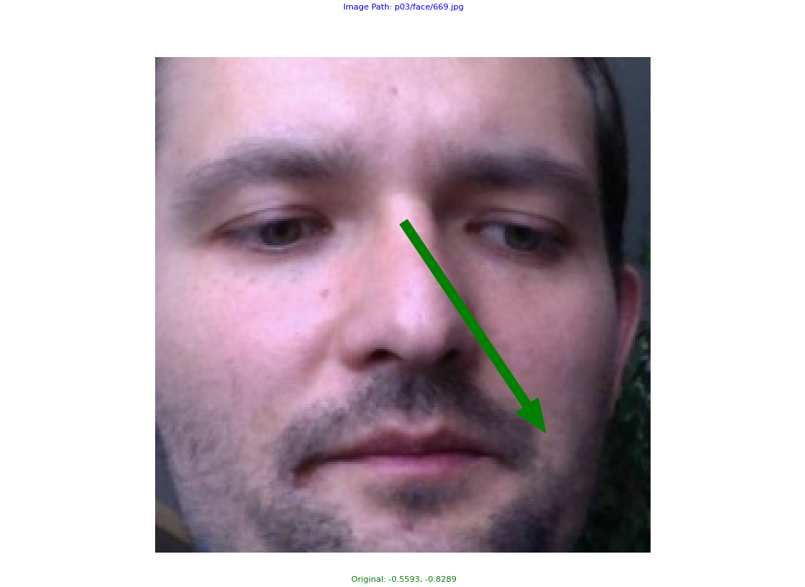
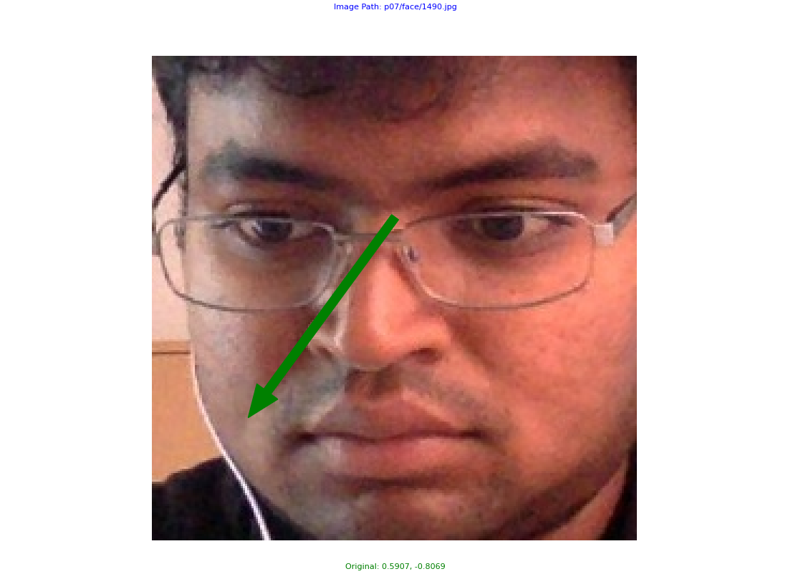
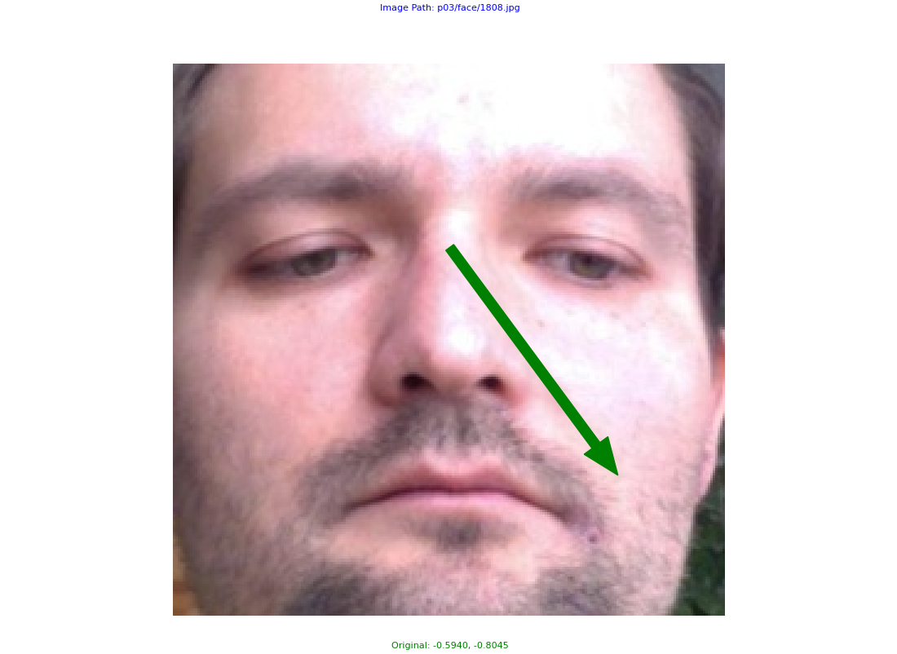
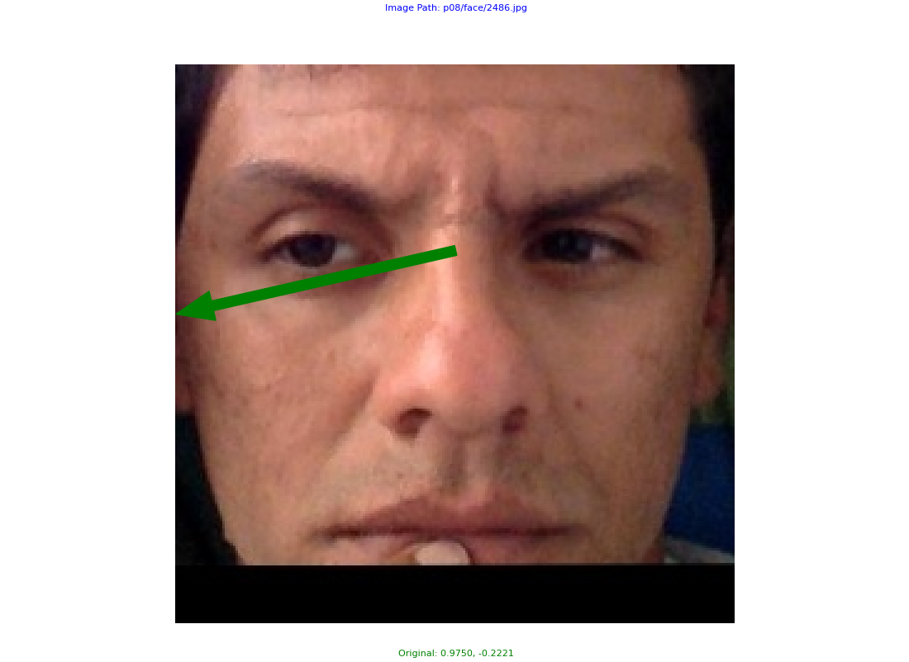
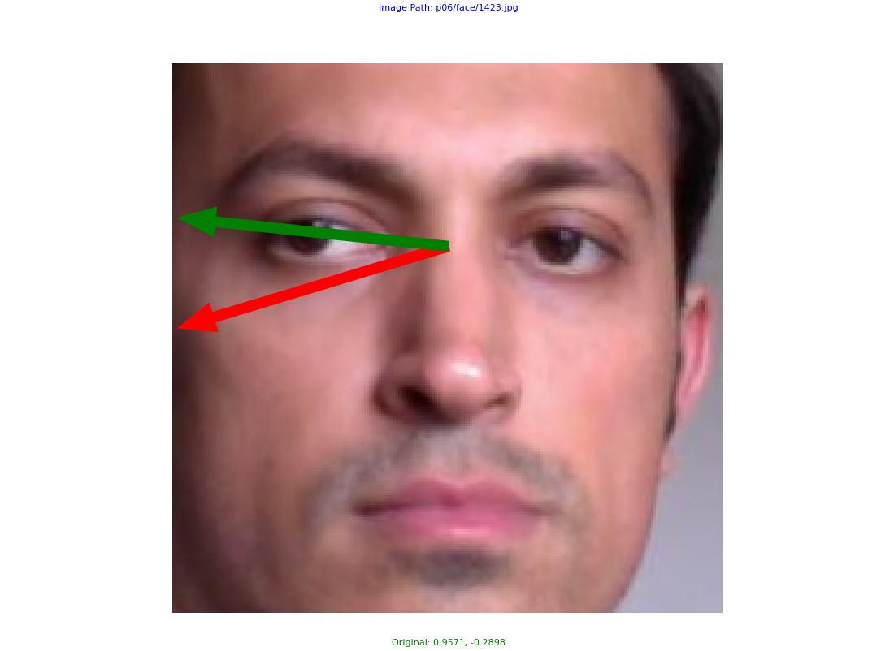
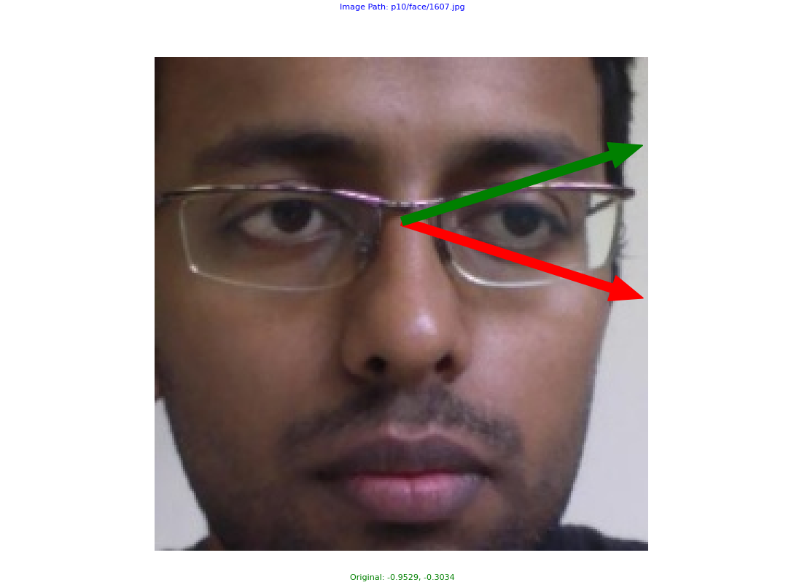
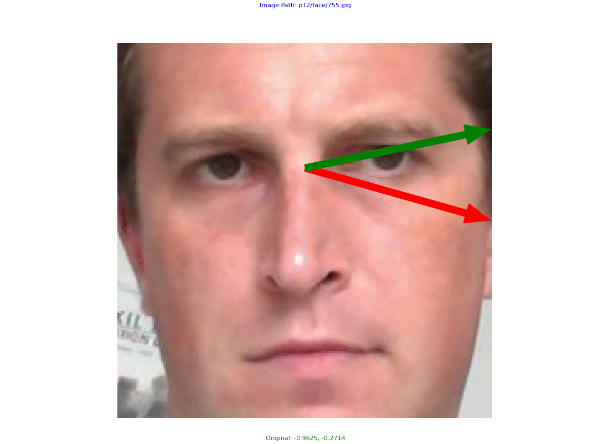
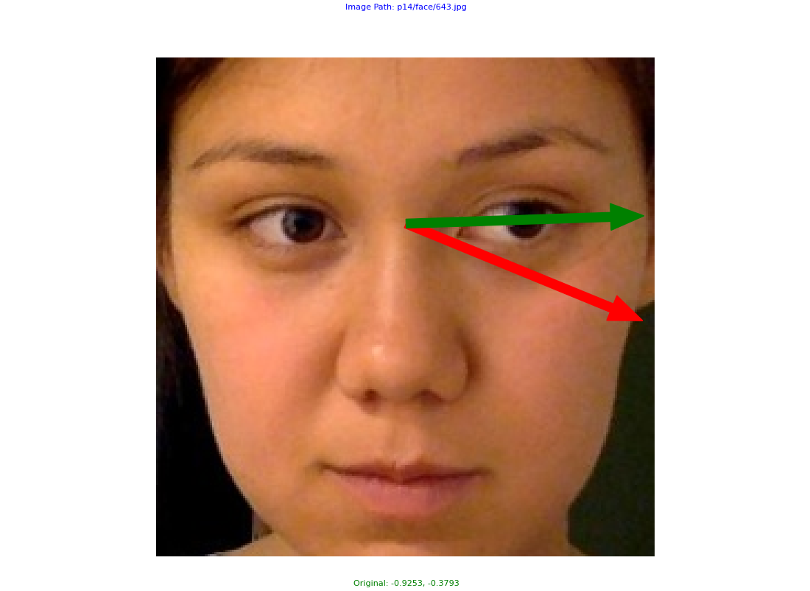

## Clean Gaze Labels vs. Noisy Gaze Labels (Detected by DMRF)
<div style="display: flex; justify-content: space-between;">
    
    
    
    
</div>

<div style="display: flex; justify-content: space-between;">
    
    
    
    
</div>

The first row shows the image with a clean label, and the green arrow indicates the direction of gaze.

The second row shows the image with the noisy label. The red arrow indicates the incorrect gaze direction, and the green arrow indicates the correct one.
___

# DMRF+L2CS-Net

The official PyTorch implementation of L2CS-Net for gaze estimation and tracking.

## 1. Installation
 

Install package with the following:

```
pip install git+https://github.com/edavalosanaya/L2CS-Net.git@main
```

Or, you can git clone the repo and install with the following:

```
pip install [-e] .
```

Now you should be able to import the package with the following command:

```
$ python
>>> import l2cs
```


## 2. Prepare datasets
* Download the **preprocessed MPIIFaceGaze dataset** (15 persons) from [here](https://phi-ai.buaa.edu.cn/Gazehub/3D-dataset/).
* Store the dataset to *datasets/MPIIFaceGaze*.

## 3. Overall Framework
The code will perform **leave-one-person-out** cross-validation.

**Flowchart in each round**:  
Training set (images of 14 persons) --> DMRF filtering (_DMRF_main_) --> Filtered dataset --> Traning L2CS-Net
--> Testing (images of 1 person)

### 3.1 Train
The code will execute the DMRF filtering on the training set and training L2CS-Net on the filtered dataset.
The well-trained models in all epochs will be stored to *output/snapshots*.

```
 python train.py 
```

### 3.2 Test and Evaluation
The above models will be evaluated on the testing set and store the results to *evaluation/L2CS-mpiigaze*.

```
 python test.py 
```

```
 python leave_one_out_eval.py 
```

## Reference

A. Abdelrahman, T. Hempel, A. Khalifa, et al., L2cs-net: Fine-grained gaze estimation in unconstrained environments, 2023 8th International Conference on Frontiers of Signal Processing, ICFSP. (2023) 98-102.

[L2CS-NET Code]([https://phi-ai.buaa.edu.cn/Gazehub/3D-dataset/](https://github.com/Ahmednull/L2CS-Net))
